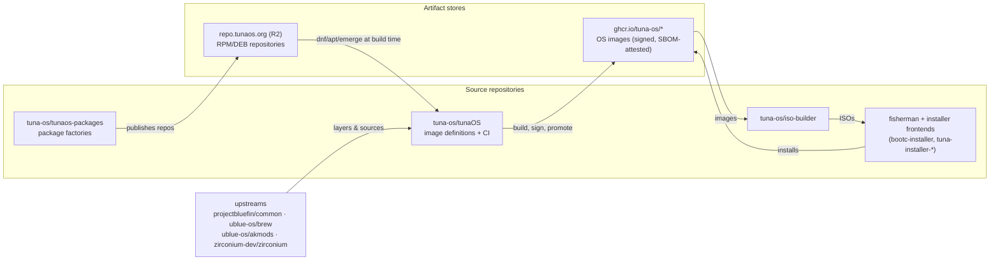
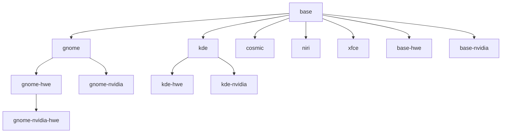
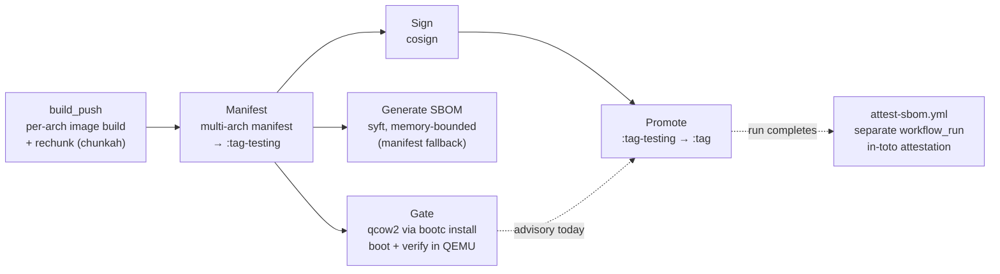
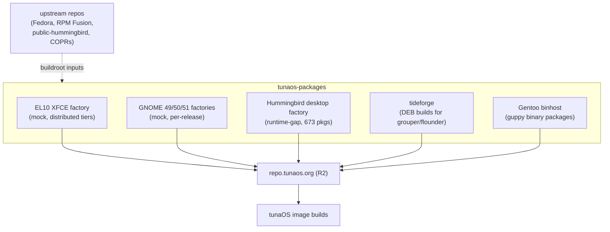
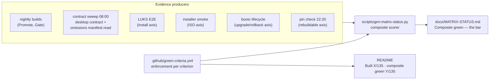

# TunaOS Developer Guide

How the whole thing works — every pipe, every gate, and why each one
exists. The [User Guide](USER-GUIDE.md) shows people what to run; this
document tells you what happens between a commit and a user's `bootc upgrade`.

TunaOS is a fork-of-ideas from the [Universal Blue](https://universal-blue.org/)
family — [Bluefin](https://projectbluefin.io) (GNOME),
[Aurora](https://getaurora.dev) (KDE),
[Bazzite](https://bazzite.gg) (gaming),
[Zirconium](https://github.com/zirconium-dev/zirconium) (Niri). We consume
their artifacts directly where we can (`ghcr.io/projectbluefin/common`,
`ghcr.io/ublue-os/brew`, `ublue-os/akmods` for NVIDIA, the Zirconium source
tree for our Niri stack). Where we can't, we re-derive their patterns. What
defines us is the same desktop on *thirteen different bases*, so most of
their Fedora-only machinery needs a base-agnostic equivalent here.

---

## 1. The map

Four repositories and two artifact stores make up the machine:



- **tunaOS** (this repo) turns base OS images + package repos into desktop
  images and publishes them to GHCR.
- **tunaos-packages** builds the packages the bases don't have (see §5) and
  publishes RPM/DEB repos to R2.
- **iso-builder** wraps published images into live ISOs (via the externally
  pinned `tacklebox`, contract in [TACKLEBOX-CONTRACT.md](TACKLEBOX-CONTRACT.md)).
- **fisherman** (Go, shared with Bluefin) + the GUI frontends do disk
  installs; [INSTALLER-FRONTENDS.md](INSTALLER-FRONTENDS.md) tracks their
  parity matrix.

## 2. The build matrix: 135 cells

**`.github/build-config.yml`** drives everything CI does: 14 variants ×
their flavors (5 desktops + `base` + hardware tiers) × declared platforms
(amd64 / amd64-v2 / arm64). A **cell** is one `(variant, flavor)` pair —
`yellowfin:gnome`, `bonito:kde-nvidia` — and there are 135 of them with
`build_image: true`. Every scoreboard, gate, and denominator in the project
derives from this file, on purpose. A flavor that isn't declared here doesn't
exist. Tests enforce that the workflows regenerate from this file, and do not
drift.

Flavors stack in a strict DAG. Hardware layers go **on top of** desktop
images, never the reverse, so CI builds each desktop exactly once per
variant:



Stage 1 builds `base`. Stage 2 fans out the desktops. Issue #1729 decoupled
stage 2 from the green status of every architecture in the base. One dead
architecture does not strand every desktop. Stages 3–4 apply the hardware
layers in `Containerfile.overlay`.

## 3. A cell's journey: `reusable-build-image.yml`

Each per-variant workflow (`build-<variant>.yml`) calls `build-variant.yml`,
which fans each cell into the reusable pipeline. This is the heart of CI:



The important details, each one paid for with a real incident:

- **Two tags per cell.** Builds land on `:<tag>-testing`; **Promote** copies
  to the published `:<tag>` only after the pipeline passes. Users pull only
  the promoted tags.
- **Rechunk**: `chunkah` re-layers the image into ostree-friendly chunks so
  `bootc upgrade` downloads deltas, not the world — same technique as
  Bluefin.
- **SBOM generation is memory-bounded** (`systemd-run --scope -p MemoryMax`
  with a runner-derived cap). syft once OOM-killed whole runners on
  Gentoo-sized package inventories. If the scan still dies,
  `scripts/packages_to_spdx.py` synthesizes an SPDX document from the image's
  own package manifest. Promote therefore never ships unattested.
- **The Gate** builds a real disk from the image (`just qcow2` →
  `bootc install to-disk --via-loopback`) and boots it in QEMU
  (`scripts/iso-e2e.sh`). It is advisory per cell today. Workstream W3 of
  [GREEN-MASTER-PLAN.md](GREEN-MASTER-PLAN.md) makes it `blocking` where CI
  can boot: the gnome and base cells. The other cells need a DRM render node,
  which hosted runners lack.
- **Retries with judgement**: promotion `skopeo` copies, GHCR pushes and
  cosign calls retry with backoff. A Sigstore outage downgrades the
  attestation; it does not block Promote (#1560).
- **SBOM attestation is a separate run**, not a job. When a build workflow
  completes, a `workflow_run` trigger starts `attest-sbom.yml`. It reads the
  digest and SBOM artifacts of that run and attests them. Before, the job ran
  inside the build. `continue-on-error` kept the job from failing, but the
  caller still reported the result of the whole reusable workflow. So one
  outage of the transparency log made a nightly with 27 of 30 images green
  report `failure`, and the README matrix showed those images as unbuilt
  (#2282). A separate workflow has its own result. Recovery stays the same:
  `rerun-infra-failures.yml` finds the `SIGSTORE_OUTAGE` marker and runs the
  job again once.

### Inside the image build

Per-family Containerfiles (`Containerfile.el10`, `.debian`, `.ubuntu`,
`.arch`, `.gentoo`, `.opensuse`, `.final`, `.overlay`) all execute the same
numbered pipeline from `build_scripts/`:

- **`lib.sh`** is the shared vocabulary. The functions that matter:
  - `install_available` / `apt_install_available` — install what the repo
    set can resolve, and **record every miss** via
    `record_package_wishlist` into `/usr/share/tunaos/missing-on-*.txt`
    inside the image. Misses are tolerated at install time and judged later
    (see §6) — that split is deliberate.
  - `install_rawhide_tolerant` — Rawhide-only `--skip-broken` retry for the
    RPM Fusion multimedia skew; strict on every pinned release. Rawhide is
    detected from os-release (`detect_fedora_ver`), because `rpm -E %fedora`
    expands to a number even on Rawhide.
  - `safe_enable` / `safe_disable` — unit toggles that tolerate
    absent-on-this-variant units.
- **`manifests/desktops/<desktop>.yaml`** declares each desktop's package
  sets per base family (`required` = contract surface, `optional` =
  best-effort), consumed by `install-desktop.sh`. The Niri stack is built
  from the pinned Zirconium source (`install-zirconium.sh`,
  `image-versions.yaml`).
- **`build_scripts/checks/`** are the in-build gates.
  `verify-desktop-experience.sh` checks the desktop contract: sessions, DM
  and portals present. `verify-package-wishlist.sh` fails the build unless
  `package-miss-allowlist.txt` declares every recorded miss acceptable.
  Silent omissions are how marlin:kde once shipped with no wayland-sessions
  at all (#858).
- **`system_files/`** is the plain-file overlay (brand assets, defaults,
  `00-tunaos.toml` bootc install config).

### Local development

```bash
just build yellowfin gnome        # build an image locally
just qcow2 ghcr.io/tuna-os/yellowfin:gnome-testing   # disk image from any ref
just run-qcow2 yellowfin gnome    # boot it in QEMU
just check                        # linters
just test                         # pytest + bats
```

One sharp edge, now fixed, is still worth a note: recipes live in imported
`just/` modules. **The directory an imported recipe runs in depends on the
`just` version** (apt's 1.21.0 runs them from `just/`, 1.25+ from the repo
root). Every module recipe therefore starts with
`cd {{ justfile_directory() }}`, and a test sweep keeps it that way — don't
remove those lines.

The test suite (`tests/`, pytest + bats) is unusual on purpose. Most tests
pin *workflow behavior*: YAML structure, generated files, gate semantics.
This repo's product is largely its pipeline. If you change the
pipeline's shape, expect a test to tell you which document or generator you
also need to update.

## 4. Nightly operations

| UTC | What |
| --- | --- |
| 22:20 | `check-base-image-pins` — every pinned base digest must still resolve (#1788: upstream GC'd three at once) |
| staggered, 00:00-23:00 | All 13 `build-<variant>.yml` nightlies, each pinned to its own cron hour to spread runner load |
| 08:00 | Desktop contract sweep — pulls every **published** desktop image; §6 |
| 13:30 | README build-status refresh → automation PR |
| on cell movement | MATRIX-STATUS regeneration → automation PR |

`main` only accepts merge-queue changes, so every automation pushes a branch
and opens a PR (direct pushes bounce off the rule). Automation PRs use one
long-lived branch each, force-pushed, so there's never more than one open.

## 5. The package factories: `tunaos-packages`

The variants only work because someone builds the packages their bases lack.
That someone is [tunaos-packages](https://github.com/tuna-os/tunaos-packages):



Design rules that hold across all factories:

- **Tiered builds**: topological orders over the real BuildRequires graph. A
  tool computes these orders; nobody maintains them by hand. The build orders
  also *generate* the workflows that run them, and tests enforce that
  regeneration.
- **A run publishes only when it built something.** A run that compiled zero
  packages must not re-sign the old repo. It must not re-upload that repo as
  if it were fresh. `INCIDENT-repo-wipe-gnome.md` is the origin story; every
  R2 writer now carries the refuse-to-publish-empty guard.
- **The tooling regenerates repos in full**, not with
  `createrepo_c --update` patches. Stale metadata entries once served
  checksums for RPMs that no longer existed (the gtkgreet drift class).
- **The Hummingbird factory tracks its upstream automatically.** Its build
  order is *the runtime gap*. It is everything the desktops need, minus
  everything `public-hummingbird` already ships. `measure-hummingbird-gap.py` measures
  this gap, from the `membership: runtime` entries in the catalog. Build-only
  tools come from the buildroot's inherited Rawhide fallback. A daily
  **gap-drift detector** re-measures the gap when upstream publishes a new
  repo revision. The detector opens a PR with the adds and drops. When
  upstream adopts a package we build, that package drops out of our order.
  Upstream's build then wins by repo priority. Our `.fc43` dist tag sorts
  below their `.hum1` on purpose, so we can never shadow them.

## 6. The quality machinery: how "green" is kept honest

This is the part most forks of Universal Blue don't have, and the part this
project considers its real product. **`.github/green-criteria.yml`** holds
the bar: ten criteria, each with an explicit `enforcement`
(`blocking` / `advisory` / `unimplemented`). A composite rule then applies:
*a cell counts as green only when every `blocking` criterion has a current
affirmative result; skipped or never-tested never counts.*



The important properties:

- **Enforcement is data, not code.** To graduate a criterion from advisory
  to `blocking`, edit one line in `green-criteria.yml`. The composite table
  and the README count then tighten automatically. If you make a criterion
  `blocking` without a wired per-cell assertion, the test suite fails with
  instructions. A raised bar can never silently render as a blank board.
- **Absence of evidence is never failure, and never success.** Skipped,
  missing, cancelled, and lost all render ⬜ and count against green. This is
  the #1730 rule, applied uniformly.
- **Nothing trusts a published image; the sweep re-checks it.** The 08:00
  sweep pulls every published desktop image. It then runs the *same* scripts
  the build ran: the desktop contract, and the omissions gate against
  `/usr/share/tunaos/missing-on-*.txt`. The sweep judges an image even when
  it shipped before the gate existed.
- **A generator writes the scoreboard, and tests hold it honest.** The tests
  go down to fine details. One: "a flavor removed from build-config keeps its
  last verdict visible but leaves the denominator". Another: "the README
  refresh opens a PR because direct pushes to main bounce".

[MATRIX-STATUS.md](MATRIX-STATUS.md) shows where each axis stands today, per
cell. [GREEN-MASTER-PLAN.md](GREEN-MASTER-PLAN.md) holds the plan to drive
all of it to `blocking`.

## 7. Troubleshooting CI — the classes we've already met

Before you debug a red run from scratch, check it against the catalogue:
[`ci-troubleshooting.md`](ci-troubleshooting.md) and the *Failures that look
like successes* section of [MATRIX-STATUS.md](MATRIX-STATUS.md). Highlights:

- A **cancelled run is not a verdict** — every reader skips superseded runs;
  never count them as failures.
- **`continue-on-error` masks step outcomes in the jobs API.** Read the raw
  logs when a step's real exit matters. The logs API gives you a signed blob
  URL.
- **Job names matter**: the matrix readers key on
  `<variant> / <flavor> / <Stage>` names. A rename of a job breaks the
  scoreboards.
- **CI retries the infra flakes by classification** (#1731), not by hand.

## 8. Repository tour

| Path | What lives there |
| :--- | :--- |
| `.github/build-config.yml` | The matrix — single source of truth |
| `.github/green-criteria.yml` | The bar |
| `.github/workflows/` | Per-variant entries, `build-variant.yml`, `reusable-build-image.yml`, sweeps and refreshers |
| `Containerfile.*` | Per-family image definitions |
| `build_scripts/` | The numbered build pipeline, `lib.sh`, `checks/`, `desktop/` |
| `manifests/desktops/*.yaml` | Desktop package contracts per base family |
| `system_files/` | Plain-file overlay shipped into every image |
| `just/` + `Justfile` | Local dev entry points (build, qcow2, VMs, tests) |
| `scripts/` | Pipeline tooling: matrix generator, parity, iso-e2e, SPDX synthesis |
| `tests/` | Pytest + bats — largely pipeline-behavior pins |
| `docs/` | You are here; [PIPELINE.md](PIPELINE.md) is the quick reference |

## 9. Contributing flow

1. Branch; `main` is merge-queue only.
2. Make the change *and* the change's paper trail. Did you touch the
   pipeline's shape, a generator, a gate, or the matrix? Then a test or a
   generated document must move with the change. CI will tell you which.
3. `just check && just test` locally.
4. PR; the queue runs the required checks and merges.

The house style comes from hard experience, and review enforces it.
**Measure, don't assume**: comments in this codebase cite run IDs. **Loud
beats silent**: a gate that can't score must fail, not skip. **Absence of
evidence is not evidence of absence**: if your change leaves something
unchecked, say so in the scoreboard. Don't let it render green.
