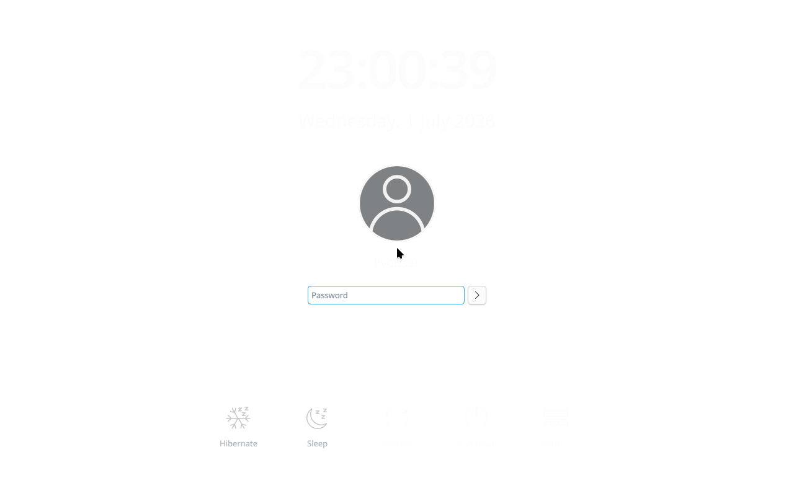
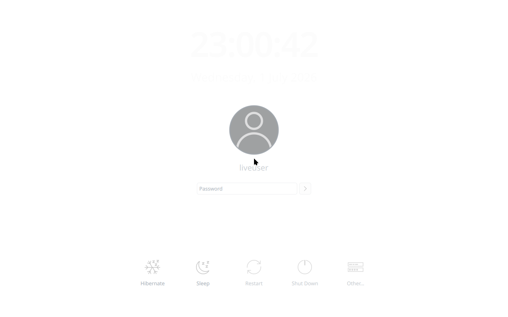
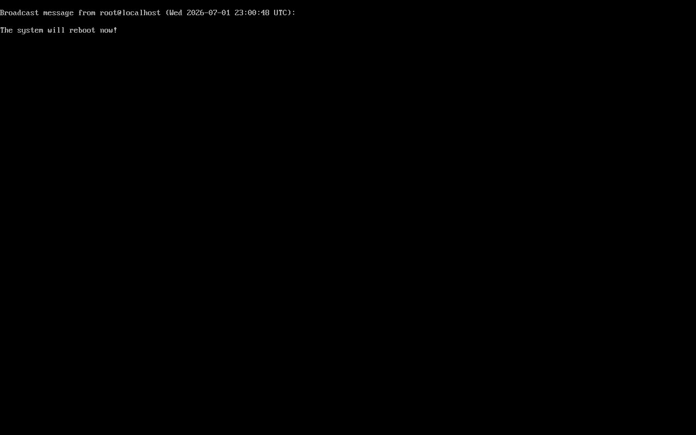
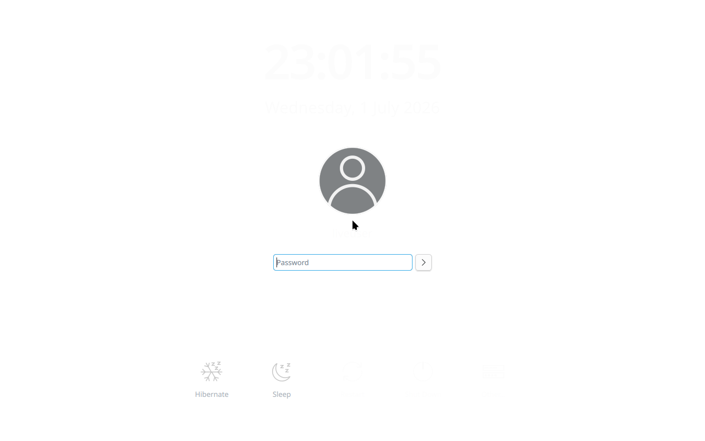
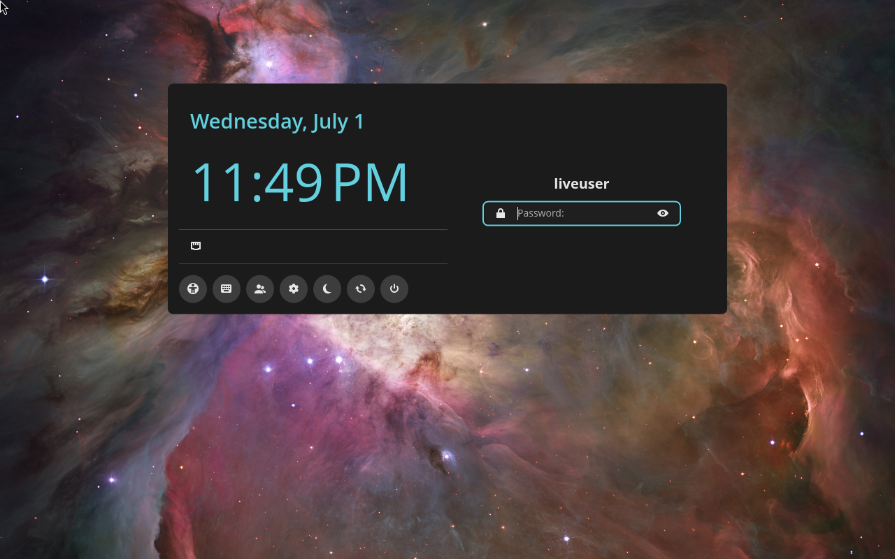
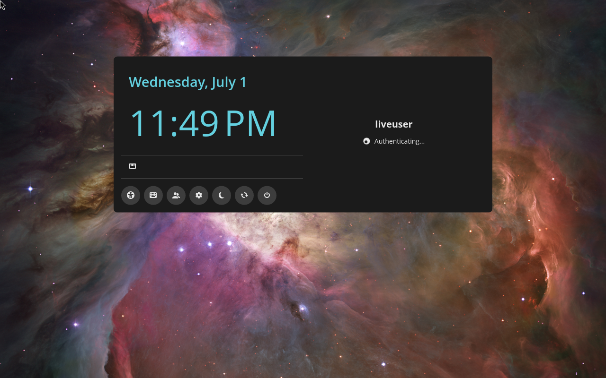
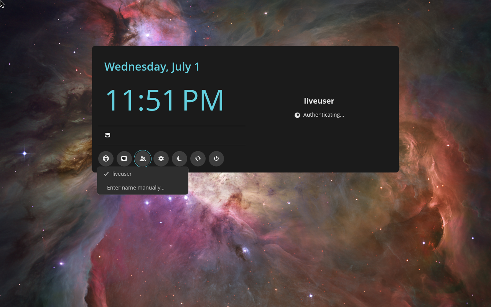

# TunaOS Installer Walkthrough

TunaOS features an intuitive GUI installer built to make deploying bootc-based operating systems to bare-metal or virtual machines as straightforward as possible.

Below are step-by-step visual guides of the installation flow for both the standard GNOME/XFCE variant and the Cosmic Desktop variant.

> These images are captured automatically: the
> [Installer Walkthrough Screenshots](../.github/workflows/installer-screenshots.yml)
> workflow boots a freshly built live ISO in QEMU every Monday, drives the
> installer with `scripts/run-walkthrough.sh`, and commits the screendumps
> here. If a screenshot looks stale or wrong, dispatch that workflow (or run
> the script locally against any built ISO) to refresh them.

## GNOME / XFCE Installer Flow

This carousel walks through the steps of installing the standard TunaOS desktop:

````carousel
### 1. Welcome Screen
The installer welcomes the user and prompts them to begin the setup.

<!-- slide -->
### 2. Disk Selection
Select the target disk drive where TunaOS will be installed.

<!-- slide -->
### 3. Installation Confirmation
Confirm the installation settings and disk target before formatting begins.

<!-- slide -->
### 4. Setup Initiated
The installer begins preparing the partitions and file system.

<!-- slide -->
### 5. Installing Packages
System files and bootc chunks are copied to the disk.

<!-- slide -->
### 6. Installation Complete
The installation has finished successfully. Reboot to start using TunaOS!

````

---

## Cosmic Desktop Installer Flow

This carousel shows the installation flow customized for the Cosmic desktop:

````carousel
### 1. Welcome Screen
The Cosmic-themed welcome screen.

<!-- slide -->
### 2. Disk Selection
Select the destination drive in the Cosmic installer.

<!-- slide -->
### 3. Installation Confirmation
Review partition layout and confirm deployment.

<!-- slide -->
### 4. Setup Initiated
Cosmic installer prepares the block devices.

<!-- slide -->
### 5. Deployment Progress
Writing the Cosmic system image and bootloader configuration.

<!-- slide -->
### 6. Finished
Installation completes successfully. Ready for the first boot!

````
