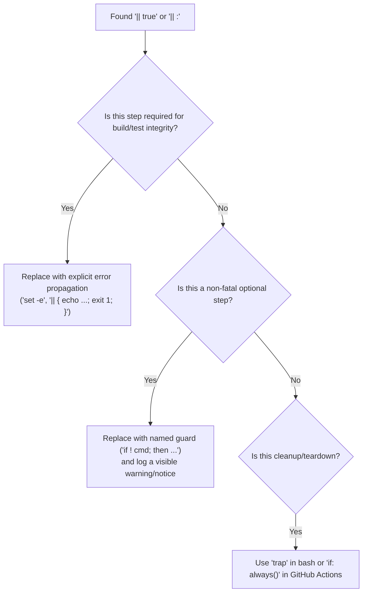

# CI Error Handling & Failure Suppression Policy

**Status**: Published Policy  
**Tracks**: [#1652](https://github.com/tuna-os/tunaos/issues/1652) (Systematic `|| true` error suppression audit & CI failure policy)  
**Applies to**: `tuna-os/tunaos` and all active repositories in the `tuna-os` organization.

---

## 🎯 1. Purpose & Motivation

In continuous integration (CI) workflows and build orchestration scripts (`Justfile`, `just/*.just`, `.github/workflows/`), error handling must be deterministic and transparent. 

A recurring anti-pattern across repositories has been the systematic use of bare `|| true` or `|| :` error suppressions to prevent pipeline failures. This masks critical build failures, conceals script breakages, and produces false "green" CI status reports while foundational steps silently fail (e.g., the boot-verify E2E suite silently swallowed by `|| true` for weeks in [#1533](https://github.com/tuna-os/tunaos/issues/1533)).

This policy establishes strict requirements for error propagation, defines approved patterns for optional/non-fatal operations, and mandates an audit and linting standard to eliminate unmanaged error suppression.

---

## 🚫 2. Core Policy: Prohibition of Silent Suppression

### 2.1. Bare `|| true` and `|| :` Prohibited
Bare error suppressions (`command || true`, `command || :`, or `command 2>/dev/null || true`) that unconditionally discard exit codes are strictly forbidden in all CI workflows, Justfile recipes, build scripts, and test runners.

### 2.2. Shell Environment Discipline
All shell scripts and workflow `run` steps must execute with fail-fast settings:
```bash
set -euo pipefail
```
- `-e`: Exit immediately if a command exits with a non-zero status.
- `-u`: Treat unset variables as an error.
- `-o pipefail`: Return the exit status of the last command in the pipe that failed.

---

## 📐 3. Remediation & Handling Patterns

When a step or command can encounter a non-zero exit code, developers and automated agents must categorize the operation and apply the appropriate standard pattern:

### 3.1. Required Steps (Fatal on Error)
If a step is required for pipeline integrity, failures must halt execution immediately with an actionable error message:

```bash
# Good: Explicit error message and non-zero exit
validate_artifacts || { echo "::error::Artifact validation failed"; exit 1; }
```

### 3.2. Legitimate Non-Fatal / Optional Steps (Named Guards)
When failure of a command is truly non-fatal (e.g., advisory cache warmers, optional notifications, telemetry, non-blocking cleanup), silent suppression is forbidden. Instead, use an explicit named guard with a diagnostic log message:

```bash
# Bad (Forbidden):
python3 -c "import custom_overlay" 2>/dev/null || true

# Good: Explicit named guard with clear rationale logged
if ! python3 -c "import custom_overlay" 2>/dev/null; then
  echo "::warning::custom_overlay unavailable, falling back to default configuration"
  CONFIG="default"
fi
```

### 3.3. GitHub Actions Workflow Steps
In `.github/workflows/*.yml`:
1. **Never append `|| true` to step run scripts.**
2. If a workflow step failure should not terminate the job, use the native `continue-on-error` property combined with an explicit comment:
   ```yaml
   - name: Upload diagnostic logs (optional)
     continue-on-error: true # Non-blocking diagnostic collection
     run: |
       ./scripts/collect-diagnostics.sh
   ```
3. Use conditional step execution (`if: always()`, `if: failure()`, `if: success()`) for cleanup and teardown routines rather than swallowing errors inside steps.

### 3.4. Justfile Recipe Conventions
In `Justfile` and `just/*.just` modules:
1. Do not use `-` prefix error suppression on recipes unless accompanied by an explanatory inline comment.
2. Group dependent commands with `&&` or rely on `set -euo pipefail` in recipe shells.
3. Replace fallback swallowing with explicit environment/argument validation.

---

## 🔍 4. Audit & Triage Playbook

All existing `|| true` and `|| :` occurrences across `tuna-os` repositories must be audited according to the following triage decision matrix:



### Audit Command
To scan a repository for violations:
```bash
grep -rnE '(\|\s*true|\|\s*:)' .github/ Justfile just/ scripts/
```

---

## 🛡️ 5. Enforcement & Maintenance

1. **Pull Request Reviews**: Reviewers and automated bots must reject changes introducing bare `|| true` error suppressions.
2. **Linting Rules**: CI lint workflows must incorporate `shellcheck` (SC2015 / pipe checks) and regex rules checking workflow YAML and Justfiles for bare suppressions.
3. **Architecture Verification**: The `architect` agent sweep will periodically measure and track suppression counts across the organization.
