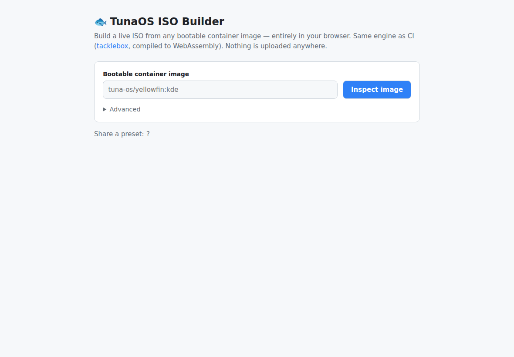
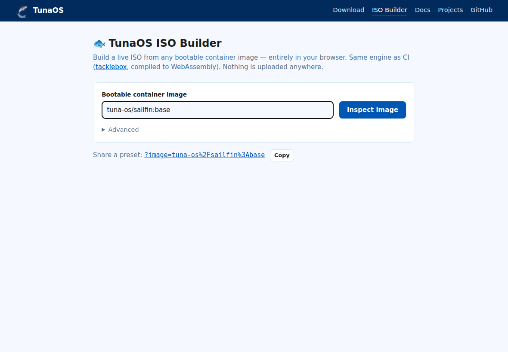
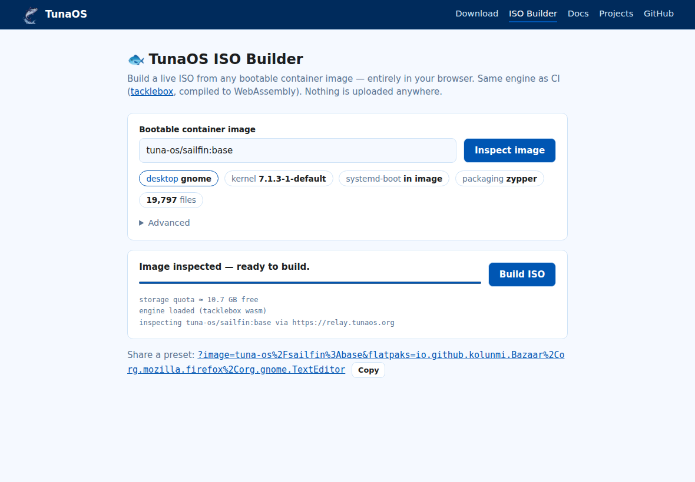
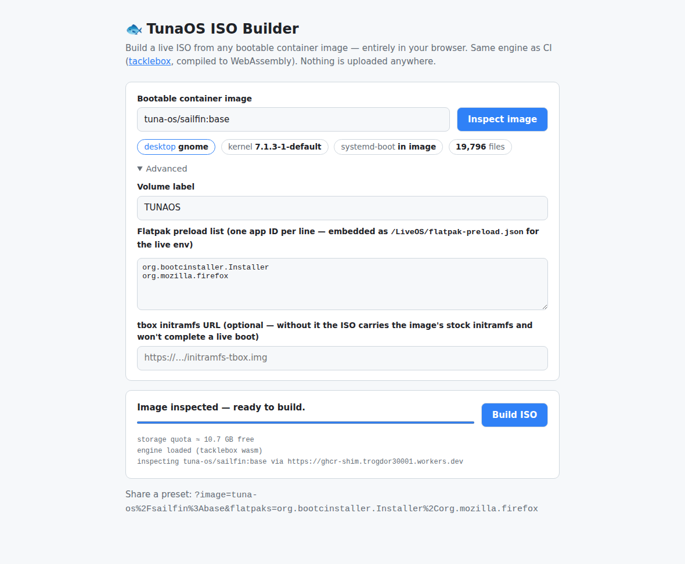

# TunaOS ISO Builder — User Guide

Build a live, bootable TunaOS ISO from any bootable container image —
**entirely in your browser**. Nothing is uploaded anywhere: the registry
pull, filesystem authoring, and ISO assembly all run locally in
WebAssembly, using the exact same engine
([tacklebox](https://github.com/tuna-os/tacklebox)'s pure-Go core) that
TunaOS CI uses to build release media.

**Test deployment:** <https://tunaos-iso-builder.trogdor30001.workers.dev>

> Screenshots below are generated automatically by the Playwright
> walkthrough (`prototype/iso-builder/e2e`, `npm run walkthrough`) — if
> the app changes, rerun it and commit the refreshed images.

## Quick start

1. **Open the builder.** You'll see the image input and an Advanced
   panel.

   

2. **Enter a bootable container image.** Anything OCI works as long as
   the image is bootc-style (kernel under `/usr/lib/modules`):
   - `tuna-os/guppy:base` — a TunaOS image on GHCR (short form)
   - `ghcr.io/you/your-os:tag` — any GHCR image (fetched via the
     TunaOS CORS relay)
   - `quay.io/…` / other registries — fetched directly; works when the
     registry sends CORS headers

   

3. **Inspect.** The engine pulls the manifest, unpacks every layer
   in-browser (whiteouts and hardlinks handled like a real container
   runtime), and shows what it found: the **desktop environment**
   (detected from the image's session files), kernel version,
   systemd-boot presence, and file count.

   

4. **Tune under Advanced (optional).**
   - **Volume label** — the ISO's `CDLABEL`.
   - **Flatpak preload list** — prefilled per detected desktop (GNOME
     and KDE have their own lists; niri/xfce default to GNOME's).
     Embedded into the ISO as `/LiveOS/flatpak-preload.json` for the
     live environment to consume.
   - **tbox initramfs URL** — see [Bootability](#bootability) below.

   

5. **Build ISO.** The ISO streams straight to disk (File System Access
   API; falls back to a regular download). The EROFS live root, FAT EFI
   system partition, and ISO9660/El Torito container are all authored
   in WASM.

## Share a preset — URL parameters

The builder is deep-linkable, so any project can point users at a
pre-configured build:

| Param | Meaning | Example |
|---|---|---|
| `image` | image to pre-fill and auto-inspect | `?image=tuna-os/guppy:base` |
| `flatpaks` | comma-separated app IDs replacing the default list | `&flatpaks=org.example.App,org.mozilla.firefox` |
| `label` | volume label | `&label=MYOS` |
| `initrd` | URL of a tbox-enabled initramfs to embed | `&initrd=https://…/initramfs.img` |

Example:
`…workers.dev/?image=ghcr.io/you/your-os:stable&label=YOUROS`

The "Share a preset" line at the bottom of the page always shows the
params for the current form state.

## Bootability

A live ISO needs an initramfs containing tacklebox's live-boot modules
(`tbox-live` — they mount the ISO, the EROFS root, and assemble the
overlay). Two paths:

- **Supply a tbox initramfs URL** (Advanced → initramfs URL): the ISO
  is then fully live-bootable, identical in layout to CI-built media.
  CI-published per-variant initramfs artifacts are planned; until then
  build one locally (`dracut --add "tbox-live tbox-root"` inside the
  image) and host it anywhere fetchable.
- **No URL supplied**: the ISO carries the image's stock initramfs. It
  boots firmware → bootloader → kernel, but stops before the live
  desktop (the stock initramfs doesn't know how to assemble a live
  root). The builder shows a warning banner in this mode.

## Current limits (MVP)

- **Memory**: the unpacked image and the EROFS live in browser memory —
  base images are fine; large desktop images need the planned
  OPFS-backed store.
- **Flatpak preload** is a manifest the live environment consumes at
  boot, not a baked flatpak deployment.
- **Registries** other than GHCR must send CORS headers (most don't);
  GHCR works for any public image via the relay.

## Testing

`prototype/iso-builder/e2e` holds the Playwright suite:

```sh
cd prototype/iso-builder/e2e
npm install && npx playwright install chromium
npx playwright test                # UI + real inspect flow
npm run walkthrough                # regenerates the doc screenshots
TBOX_E2E_FULL=1 npx playwright test  # + full ISO build & PVD check
```

The `iso-builder-e2e` workflow runs the same suite in CI on changes to
`prototype/iso-builder/**`.
