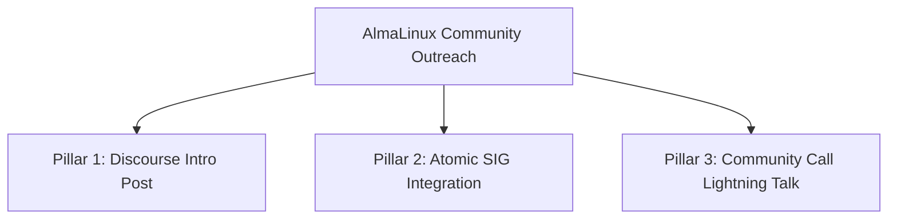

# AlmaLinux Community Engagement & Atomic SIG Showcase Playbook

> Status: **draft** — for maintainer review. Do **not** post externally without
> maintainer sign-off.  
> Tracking: [#1757](https://github.com/tuna-os/tunaOS/issues/1757).  
> Fact-checked 2026-08-30 against `README.md`, `ROADMAP.md`, and `ADOPTERS.md`
> per the maintainer's press-claim guard ([#1667](https://github.com/tuna-os/tunaOS/issues/1667)).

---

## 1. Context & Strategic Alignment

TunaOS's flagship variants are founded directly on AlmaLinux:
- **Albacore:** Enterprise Linux desktop founded on **AlmaLinux 10 / RHEL 10** (GNOME, KDE Plasma, COSMIC, Niri flavors; x86_64 and arm64).
- **Yellowfin:** Next-generation enterprise desktop founded on **AlmaLinux Kitten 10** (CentOS Stream 10 tracking).

AlmaLinux maintains an active **Atomic SIG** dedicated to advancing container-native, image-mode `bootc` systems. While server and edge deployments are well-represented in the SIG, TunaOS provides the missing showcase: a complete, daily-rebuilt, daily-tested immutable workstation and desktop built on AlmaLinux 10.

---

## 2. Community Outreach Pillars



### Pillar 1: AlmaLinux Discourse Post (`lists.almalinux.org` / Forum)
**Goal:** Introduce TunaOS to the wider AlmaLinux user and sysadmin community.

**Draft Post Copy:**
```markdown
**Title:** TunaOS: A Container-Native Immutable Desktop on AlmaLinux 10

Hello AlmaLinux Community,

We are excited to introduce **TunaOS**, an open-source, image-based desktop distribution built directly on AlmaLinux 10 and AlmaLinux Kitten 10.

### Why an Immutable Desktop on Enterprise Linux?
Enterprise Linux is renowned for decade-long stability, robust server performance, and hardware reliability. However, workstation users often struggle with the balance between platform stability and access to modern desktop environments and zero-maintenance updates.

TunaOS solves this by packaging the entire desktop as a bootable OCI container via `bootc`:
- **Albacore:** AlmaLinux 10 (RHEL 10 base) with GNOME, KDE Plasma, COSMIC, and Niri desktop environments.
- **Yellowfin:** AlmaLinux Kitten 10 with bleeding-edge upstream desktop backports.
- **Atomic Reliability:** System updates are single transactional image downloads. Instant `bootc rollback` guarantees a known good system if anything goes wrong.
- **Keyless Supply Chain:** Every image build is signed with Sigstore/cosign keyless signatures and verifiable SBOMs.

### Try Albacore GNOME:
```bash
bootc switch ghcr.io/tuna-os/albacore:gnome
```

We would love to collaborate closely with the AlmaLinux community and gather your feedback!

- GitHub Repository: https://github.com/tuna-os/tunaOS
- Docs & Guides: https://tunaos.org
```

---

### Pillar 2: AlmaLinux Atomic SIG Collaboration
**Goal:** Position TunaOS as a flagship reference implementation for the Atomic SIG.

- **Action Items:**
  1. Join the official Atomic SIG communication channel (`chat.almalinux.org/almalinux/channels/sigatomic`).
  2. Share TunaOS's Containerfile patterns, DDI smoke testing workflows, and custom initramfs generation learnings.
  3. Offer TunaOS as an upstream-adjacent testbed for testing `bootc`, `composefs`, and keyless container validation on EL10.

---

### Pillar 3: Monthly Community Call Lightning Talk
**Goal:** Deliver a 10-minute presentation and live demo at an AlmaLinux Community Call.

**Talk Outline (10 Minutes):**
1. **Introduction (2 min):** The evolution of image-based desktops and why AlmaLinux 10 is the ideal foundation.
2. **Architecture (3 min):** Bootc container lifecycle, image layers, and immutable `/usr`.
3. **Live Demo (3 min):**
   - Booting Albacore GNOME on AlmaLinux 10.
   - Performing a transactional `bootc upgrade`.
   - Demonstrating instant reboot rollback (`bootc rollback`).
4. **Q&A and Call for Contributors (2 min):** Connecting through GitHub Discussions and Matrix.

---

## 3. Governance & Fact-Check Guardrails (per #1667)

- **Relationship Integrity:** AlmaLinux is TunaOS's upstream base dependency. Do not claim formal organizational partnership or commercial endorsement from the AlmaLinux OS Foundation unless officially formalized.
- **Sign-Off:** Review post copy with project maintainers before publishing on Discourse or joining the community call.
- **Logging:** Update `docs/ADOPTION-OUTREACH-STATUS.md` with thread URLs and SIG meeting notes.
