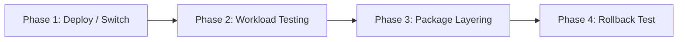

# Fedora 45 Beta Testing Call & Bonito Roadmap Guide

> Status: **draft** — for maintainer review. Do **not** post externally without
> maintainer sign-off.  
> Tracking: [#1742](https://github.com/tuna-os/tunaOS/issues/1742).  
> Supports: [#1137](https://github.com/tuna-os/tunaOS/issues/1137) (Fedora Magazine Guest Post Pitch) &
> [#1166](https://github.com/tuna-os/tunaOS/issues/1166) (Q4 Release Calendar).  
> Fact-checked 2026-08-30 against `FEDORA-BASE-POLICY.md` and `README.md` per [#1667](https://github.com/tuna-os/tunaOS/issues/1667).

---

## 1. Background & Architecture: Bonito on Fedora Streams

TunaOS's **Bonito** variant brings an immutable, image-mode `bootc` desktop experience to users who prefer the modern Fedora package base.

### Understanding the Fedora Stream Mapping
Per TunaOS's build configuration and `FEDORA-BASE-POLICY.md`:

| Image Target | Upstream Base Stream | Role & Target Audience |
|---|---|---|
| `ghcr.io/tuna-os/bonito:<flavor>` | **Fedora 44** (`quay.io/fedora/fedora-bootc:44`) | Current stable Bonito release line |
| `ghcr.io/tuna-os/bonito:<flavor>-rawhide` | **Fedora Rawhide / Branching 45** | Development stream tracking next-generation Fedora components |

> [!NOTE]
> **Clear Framing for Testers:**  
> During the Fedora 45 beta window, testing the `bonito:<flavor>-rawhide` stream exercises the upstream Fedora 45 development base before GA branching is finalized. This testing campaign targets Fedora community power users who participate in Fedora Test Days and want to validate containerized desktop flows.

---

## 2. Beta Testing Objectives

1. **Base Bootc Compatibility:** Validate that upstream kernel, systemd, and ostree/bootc updates cleanly compose and boot across physical and virtual hardware.
2. **Package Layering Stability:** Test client-side package additions via `dnf5` and container layering without breaking the immutable base.
3. **Rollback Verification:** Ensure failed upgrades can be rolled back instantly via `bootc rollback`.
4. **Community Engagement:** Connect with Fedora enthusiasts and channel findings into the upcoming Fedora Magazine article ([#1137](https://github.com/tuna-os/tunaOS/issues/1137)) and Q4 calendar ([#1166](https://github.com/tuna-os/tunaOS/issues/1166)).

---

## 3. Step-by-Step Testing Checklist

Testers should follow this four-phase protocol:



### Phase 1: Installation & Boot Verification
```bash
# Switch to the Bonito Rawhide / F45 stream (e.g. GNOME or KDE):
sudo bootc switch ghcr.io/tuna-os/bonito:gnome-rawhide
sudo systemctl reboot
```
- [ ] System boots cleanly to graphical login (GDM / SDDM).
- [ ] `bootc status` reports the rawhide image as the active deployment.

### Phase 2: Hardware Acceleration & Desktop Functionality
- [ ] Wayland session runs with full GPU acceleration (`glxinfo -B` / `vulkaninfo --summary`).
- [ ] Audio (PipeWire) and Bluetooth devices connect and persist after resume from suspend.
- [ ] Flatpak application installs and updates execute cleanly.

### Phase 3: Package Layering (`dnf5`)
```bash
# Test layering a utility onto the deployment:
sudo bootc usroverlay
sudo dnf5 install -y fastfetch htop
```
- [ ] Layered packages function without dependency resolution errors.

### Phase 4: Atomic Rollback Test
```bash
# Verify the rollback mechanism works as expected:
sudo bootc rollback
sudo systemctl reboot
```
- [ ] Machine returns seamlessly to the previous deployment pin without manual GRUB rescue.

---

## 4. Community Announcement Draft: r/Fedora & Fedora Discussions

**Title:** Fedora 45 Beta Window: Test TunaOS Bonito's Container-Native Bootc Desktop

**Body:**

```markdown
Hello Fedora community!

With the Fedora 45 beta cycle in full swing, we invite Fedora testers and atomic desktop enthusiasts to test **TunaOS Bonito** on the Fedora 45/rawhide development stream.

### What is Bonito?
Bonito is an immutable, container-native desktop built directly from Fedora's official `fedora-bootc` images. Instead of traditional package updates, the entire OS updates as a single OCI image with full atomic rollback guarantees.

### How to test:
You can test Bonito in a VM (QEMU/KVM) or on bare metal by switching your deployment:

```bash
sudo bootc switch ghcr.io/tuna-os/bonito:gnome-rawhide
sudo systemctl reboot
```

### What we're validating:
- Boot reliability and Wayland compositor stability across Intel/AMD/NVIDIA GPUs.
- Desktop flavor integration (GNOME, KDE Plasma, COSMIC, Niri).
- Clean `bootc upgrade` and `bootc rollback` cycles.

If you encounter any issues or want to contribute test results, please check out our repo or file a ticket:
- GitHub: https://github.com/tuna-os/tunaOS
- Good First Issues: https://github.com/tuna-os/tunaOS/labels/good-first-issue

Thank you for helping us make container-native Fedora desktops rock-solid!
```

---

## 5. Review & Outreach Checklist

- [ ] Verify CI build status for `bonito` and `bonito-rawhide` before publishing.
- [ ] Confirm Fedora 45 beta release milestones against the Fedora Wiki schedule.
- [ ] Maintainer approval obtained prior to posting on r/Fedora and Fedora Discussions.
- [ ] Log discussion threads in `docs/ADOPTION-OUTREACH-STATUS.md`.
