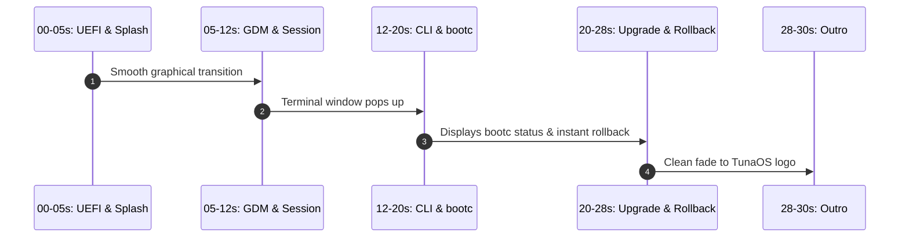

# README & Landing Page Hero Demo Technical Specification

> Status: **draft** — for maintainer review and asset capture.  
> Issue: [#1760](https://github.com/tuna-os/tunaOS/issues/1760).  
> Supports: [#1333](https://github.com/tuna-os/tunaOS/issues/1333) (DistroWatch),
> [#1346](https://github.com/tuna-os/tunaOS/issues/1346) (Reddit/Lemmy),
> [#1534](https://github.com/tuna-os/tunaOS/issues/1534) (Tech Press),
> [#1759](https://github.com/tuna-os/tunaOS/issues/1759) (Show HN).  
> Fact-checked 2026-08-30 per [#1667](https://github.com/tuna-os/tunaOS/issues/1667).

---

## 1. Objective & Value Proposition

First-time visitors to the GitHub repository (`README.md`) and the project website (`tunaos.org`) encounter text descriptions and build matrices without immediate visual proof of the user experience.

A concise **25–30 second boot-to-desktop demo** shows the desktop in action. It is available as an animated WebP/GIF and an MP4/WebM video. This asset introduces new users, contributors, and reviewers to TunaOS.

---

## 2. Capture Environment & Parameters

| Parameter | Specification |
|---|---|
| **Target Variant** | **Albacore GNOME** (`ghcr.io/tuna-os/albacore:gnome`) on AlmaLinux 10 |
| **Virtualization Platform** | QEMU/KVM with VirtIO-GPU acceleration (per `docs/tunaos/evaluating-in-a-vm.md`) |
| **Capture Resolution** | 1920×1080 (1080p source), downscaled to 1280×720 (720p) for distribution |
| **Framerate** | 30 fps (video source), 15 fps (optimized GIF/WebP) |
| **Duration Limit** | 25 to 30 seconds maximum |
| **Asset Budgets** | **GIF/WebP:** < 500 KB (optimized preview) <br> **MP4 / WebM:** < 3.0 MB (H.264 / VP9 / AV1) |

---

## 3. Storyboard & Scene Breakdown



### Timeline & Actions:
- **0:00 – 0:05 | System Boot:** Fast UEFI boot sequence with the TunaOS Plymouth boot splash.
- **0:05 – 0:12 | Desktop Launch:** Automatic login to GNOME 51 with clean wallpaper and top bar.
- **0:12 – 0:20 | Terminal:** Run terminal commands:
  ```bash
  fastfetch
  bootc status
  ```
  *(Shows image digest and AlmaLinux base).*
- **0:20 – 0:28 | Atomic Operations:** Run atomic commands:
  ```bash
  sudo bootc upgrade
  sudo bootc rollback
  ```
  *(Demonstrates updates and rollback safety).*
- **0:28 – 0:30 | Title Card Fade:** Short fade with TunaOS emblem and website link.

---

## 4. Generation Pipeline & Optimization Tooling

### Step 1: Capture Raw Video via QEMU / `wf-recorder`
```bash
# Launch VM and record display via PipeWire/Wayland recorder:
wf-recorder -g "0,0 1920x1080" -f /tmp/raw-boot-demo.mp4
```

### Step 2: Transcode to Web-Optimized MP4 / WebM
```bash
ffmpeg -i /tmp/raw-boot-demo.mp4 \
  -vf "scale=1280:-1:flags=lanczos" \
  -c:v libx264 -crf 22 -preset slow -an \
  -movflags +faststart docs/images/hero-demo.mp4
```

### Step 3: Generate Ultra-Lightweight Animated GIF / WebP (< 500 KB)
```bash
# Generate high-efficiency color palette:
ffmpeg -y -i docs/images/hero-demo.mp4 -vf "fps=12,scale=800:-1:flags=lanczos,palettegen=stats_mode=diff" /tmp/palette.png

# Encode gif with palette:
ffmpeg -i docs/images/hero-demo.mp4 -i /tmp/palette.png -lavfi "fps=12,scale=800:-1:flags=lanczos [x]; [x][1:v] paletteuse=dither=bayer:bayer_scale=3" /tmp/hero-demo.gif

# Optimize via gifsicle:
gifsicle -O3 --lossy=80 -o docs/images/hero-demo.gif /tmp/hero-demo.gif
```

---

## 5. Deployment Locations

1. **`README.md`:** Insert below badges:
   ```markdown
   [](https://tunaos.org)
   ```
2. **Website:** Embed HTML5 video on `tunaos.org`.
3. **Gallery Index:** Add the asset to `docs/SCREENSHOTS.md`.
4. **Media Kits:** Cite the asset in `docs/PRESSKIT.md`.
